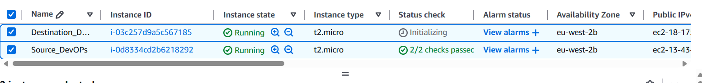
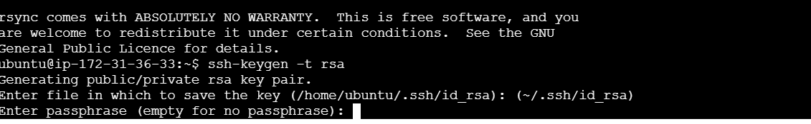
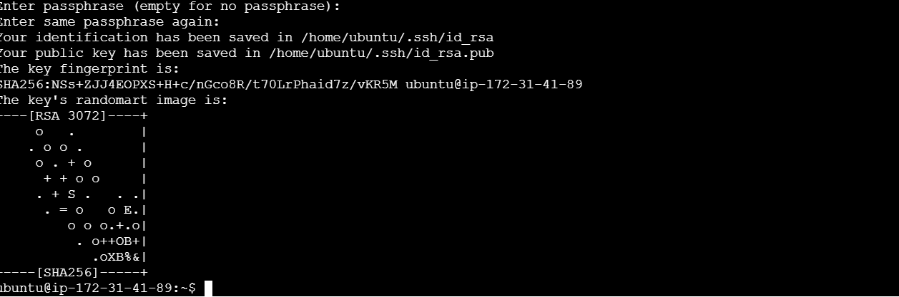
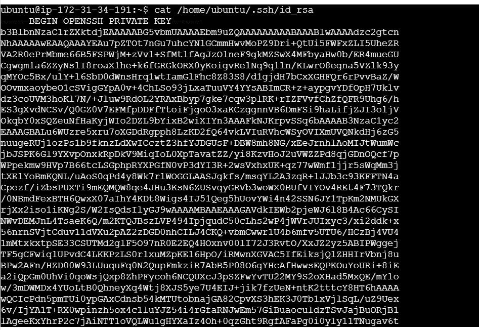
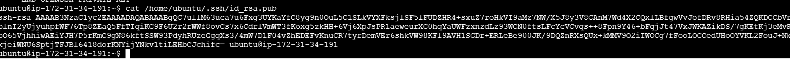
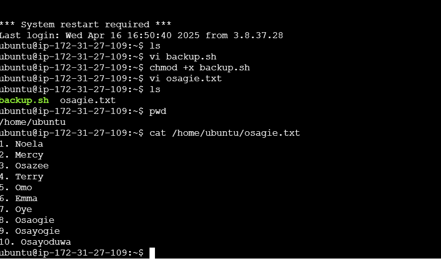
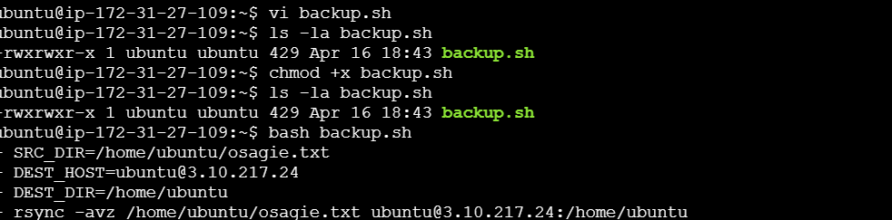

# Automated Backup System Using Rsync

## Project Overview:

In this project, we'll create an automated backup system using ```rsync 
                    ```
to synchronize files and directories between two Ubuntu servers. One server will act as the source server, containing the files to be backed up, and the other server will serve as the destination server, where the backups will be stored. We'll schedule regular backups using cron jobs and configure email notifications for backup completion or failure.

### Prerequisites:

* Two Ubuntu servers (source and destination)
* SSH access to both servers
* Basic knowledge of Linux command line

## Step-by-Step Implementation:

### Step 1 : Setup Source and Destination Servers on AWS

* Log in to your AWS Management Console.

* Launch two Ubuntu EC2 instances (one for the source and one for the destination)




* Connect to both servers via SSH

* Update the package list and install ```rsync    
       ```

```
sudo apt update

sudo apt install rsync
```

* Check the installed version of rsync to confirm the installation:

```
rsync --version 
```

### Step 2 : Configure SSH Key-Based Authentication:

To enable secure, password-less communication between the source and destination servers, configure SSH key-based authentication.

* Generate an SSH key pair on the Source Server:

```
ssh-keygen -t rsa
```

Press ```Enter  
      ```
to accept the default key location ```(~/.ssh/id_rsa)
     ```

Leave the passphrase empty for automation.














* Copy the Public Key to the Destination Server

```
ssh-copy-id username@destination_server_ip
```

If   ```ssh-copy-id
     ```
doesn’t work, manually copy the public key:

* Display the public key on the source server:

```
cat ~/.ssh/id_rsa.pub
```

* Copy the displayed text

* On the Destination Server, add the copied key to the   ```authorized_keys
             ```
file:

```
echo "your_copied_public_key_here" >> ~/.ssh/authorized_keys
```

* Set the correct permissions for the  ```authorized_keys
      ```
file:

```
chmod 600 ~/.ssh/authorized_keys
```

* Once the public key has been copied try connecting to the destination server using SSH from the source server:

```
ssh username@target_server_ip_address
```

If successful, you should be able to log in without a password.


### Step 3 : Create a Backup Script:

* On the source server, create a backup script:

```
vi backup.sh
```

* Add the Following Script:

Replace the placeholders with your actual paths and server details

```
#!/bin/bash

set -ex  # Exit on errors and print commands

# Define source and destination directories
SRC_DIR="/home/ubuntu/osagie.txt"
DEST_HOST="ubuntu@172.31.27.154"
DEST_DIR="/home/ubuntu"

# Rsync command to synchronize files and directories
rsync -avz "$SRC_DIR" "$DEST_HOST:$DEST_DIR"
# Check rsync exit status

if [ $? -eq 0 ]; then
    echo "Backup completed successfully."

else
    echo "Backup failed!"

fi

```

* Save the script and exit.

* Make the script executable:

```
chmod +x backup.sh
```

### Step-4 : Schedule Backup with Cron:

* Edit the crontab file to schedule regular backups:

```
crontab -e
```

* Add a cron job to execute the backup script at the desired interval. for every 2hours:

```
0 */2 * * * /path/to/backup.sh
```

* List the cron jobs to confirm the backup job is scheduled:

```
crontab -l
```

# Conclusion

In this project, you learned how to:

✅ Set up an automated backup system using rsync.

✅ Configure SSH key-based authentication for secure access.

✅ Use cron jobs to schedule periodic backups.

Project Completed!🎉
   


                                      


 
 


